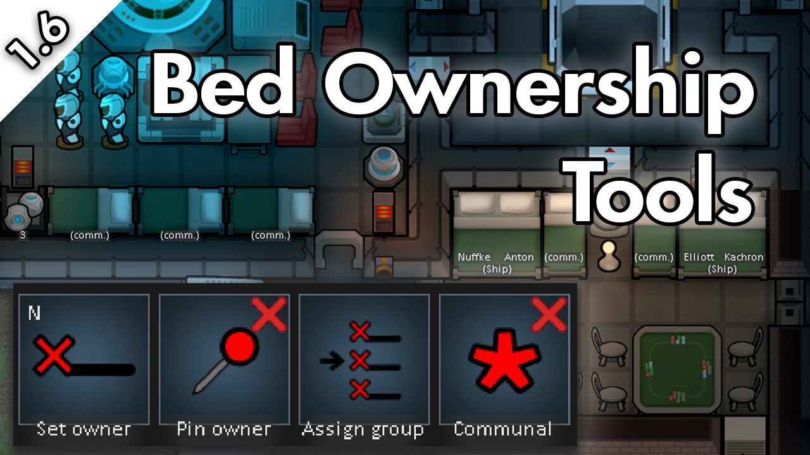
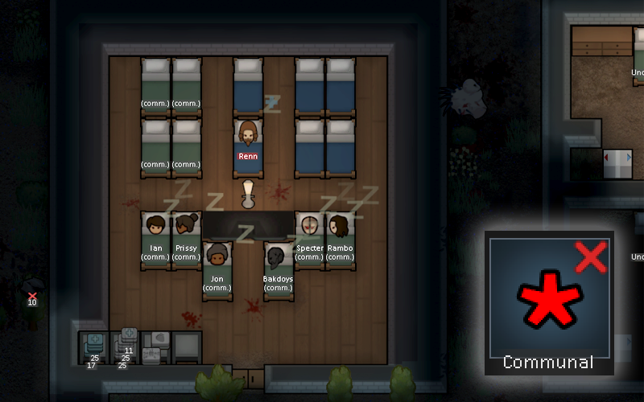
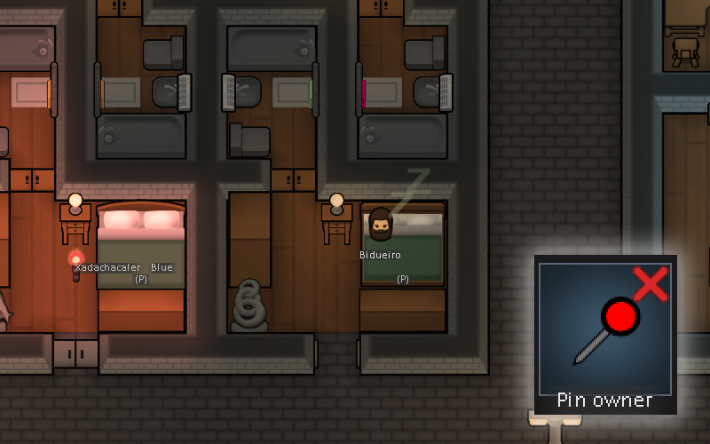
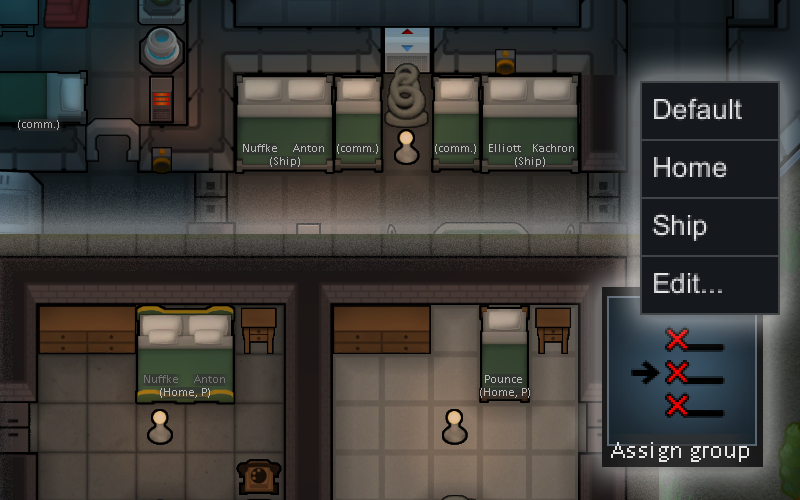
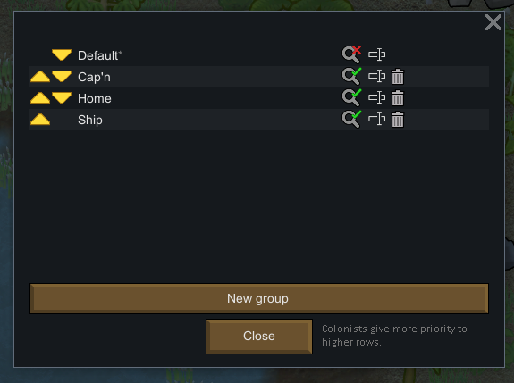
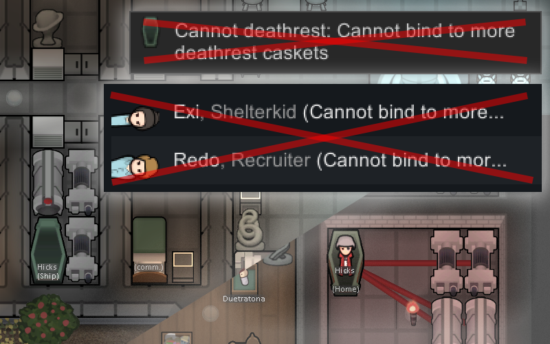
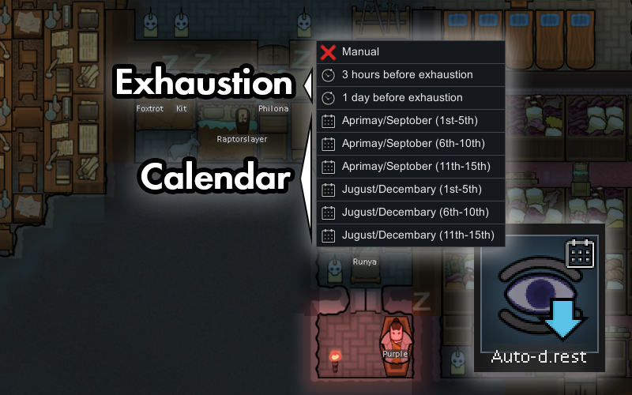

[Steam Workshop](https://steamcommunity.com/sharedfiles/filedetails/?id=3558407174)

[GitHub](https://github.com/p0lymeric/RimWorldBedOwnershipTools/releases)

# Bed Ownership Tools

Bed Ownership Tools reduces micromanagement of colonists' bed assignments by introducing new ownership controls on beds.

**(New) Version 1.1 adds deathrest features.** Sanguophages and colonists with the deathrest gene can now own multiple deathrest chambers and optionally follow automatic deathrest schedules.

## Features
#### Core
- **Communal beds** - Assignment-free beds that are automatically shared between colonists.
- **Pinned assignments** - Prevent colonists from forgetting their bed assignments unless manually reassigned by the player.
- **Assignment groups** - Allow colonists to own and automatically switch between multiple beds during travel or zoning.

#### Deathrest (*Biotech DLC only*)
- **Spare deathrest bindings** - Allow deathresters to switch between multiple sets of deathrest buildings.
- **Automatic deathrest** - Assign exhaustion-based or calendar deathrest schedules to individual deathresters.

Individual features can be disabled in the mod's settings.

## Communal beds

Communal beds are good for situations when colonists need a bed, but cannot access a permanent bed due to travel, zoning restrictions, or limited availability of permanent bedrooms.

Instead of assigning named owners to beds, you can now mark a bed for "communal" use. When a colonist cannot access or claim an owned bed, they'll use a communal bed before sleeping on the ground. While using a communal bed, they'll still remember their previous bed.

Colonists will coordinate use of single and double communal beds to allow couples to sleep together.

## Pinned assignments

Perhaps you've sent several colonists to a quest site and mass-claimed buildings before. A brief undraft to have the (exhausted) troops perform some deconstruction, and half of your colony has suddenly forgotten their home beds in favour of some dead tribals' bed rolls.

Pinned assignments prevent colonists from forgetting prior bed assignments, unless manually reassigned by the player (or arrested, killed, divorced, etc.) By pinning those colonists' home bed assignments beforehand, they'll sleep on the ground instead. This gives you a chance to intervene.

## Assignment groups

Assignment groups allow colonists to own and automatically switch between multiple beds based on priority rankings.

You may find multiple assignments useful for late-game colonies where colonists have personalized bedrooms.

Perhaps you have a large gravship and wish to build second bedrooms on the ship. But, you might have a greedy colonist whose bedrooms should be just slightly fancier than your archon's. Or many couples whose bed assignments are painful to redo.

With assignment groups, you can set up ownership associations once per bed and have the game automatically switch between them.

### Getting started with assignment groups

Let's say you wish for your colony to normally sleep in their home base, but also have dedicated beds on their gravship.

1. Shift-select all the beds in the base, and click "Assign group" > "Home".
2. Then, do the same for the beds on the ship, with "Assign group" > "Ship".
3. Set each bed's ownership with "Set owner". You should notice that assignments within the Home group and Ship group don't conflict with each other.

Now, when your gravship is landed at your home base, your crew will sleep in their Home bedrooms.
When a crew member is on a mission, or if they've been zoned into the gravship, they'll use their Ship bed instead.

Let's say you want your ship's captain to sleep in their quarters when possible (for the fun of it), while the rest of the crew prefer to sleep at home. To do this, you can create another assignment group.

1. To do this, click on any bed, and select "Assign group" > "Edit...".
2. A dialog will appear where you can add/rename/remove groups, and reorder their priorities.
3. Create a new untitled group, rename it to "Cap'n", and prioritize it above Home.
4. Click on the captain's intended bed on the gravship, and select "Assign group" > "Cap'n".

Maybe the captain got malaria and is out of commission for an urgent quest. No worries at all.
- While the ship is away, the captain will automatically use their Home bed instead.
- The crew members who leave for the quest will switch from their Home to Ship beds on the first night out.

# Spare deathrest bindings

Spare deathrest bindings allow colonists to switch between multiple deathrest caskets and buildings beyond their serum binding capacity.

You can use this feature by constructing two sets of deathrest buildings for a deathrester and ordering them to deathrest in both. Unlike the base game, they won't be blocked from using the second casket.

Once a building is bound, it normally cannot be reassigned to another user. This behaviour can be disabled by unchecking "Deathrest bindings are permanent" in the mod's settings.

# Automatic deathrest

Automatic deathrest allows colonists to follow a given schedule for deathrest.

The mod provides two kinds of schedules:
- **Exhaustion-driven** - The deathrester will deathrest after their need falls below a certain level. This scheme can tolerate manual overrides like disabling Auto-wake or keeping a colonist awake past exhaustion.
- **Calendar** - The deathrester will always deathrest in the specified "weeks" of the year or when almost exhausted. If blocked long enough from following the schedule, they may rest twice in a period to realign with the calendar.

Exhaustion-driven schedules are straightforward to use. Calendar scheduling allows you to prevent deathrest period overlap between multiple colonists.

Beds can be used for automatic deathrest by unchecking "Ignore beds for automatic deathrest" in the mod's settings.

Deathrest auto-scheduling controls can be accessed by selecting:
- one of the colonist's deathrest caskets
- one of the colonist's beds (if "Ignore beds for automatic deathrest" is unchecked in the mod's settings)
- the colonist themselves while they are deathresting
- the colonist themselves while they are awake (by unchecking "Hide deathrest auto-controls on pawn while awake" in the mod's settings)

## Save compatibility
It's safe to add or remove this mod at any time. You may see harmless one-time errors printed to the game's console following mod removal.

Upon mod removal:
- colonists with multiple bed assignments will own the last non-communal bed they used.
- colonists with spare deathrest bindings will be bound to the last set of buildings they used.

## Mod compatibility
Bed Ownership Tools has built-in support for a growing list of mods that interact with bed assignments. These include:
- Hospitality
- One bed to sleep with all - Polycule Edition
- Loft Bed
- Bunk Beds
- MultiFloors

An updated list is available on [GitHub](https://github.com/p0lymeric/RimWorldBedOwnershipTools/blob/master/Documentation/ModCompatibility.md).

If you encounter a compatibility problem with another mod, please report it as an issue.

## Issue reporting
Please post in the Bug Reports thread on the mod's [Steam Workshop bug thread](https://steamcommunity.com/workshop/filedetails/discussion/3558407174/600787986327757372/), or [file an issue on GitHub](https://github.com/p0lymeric/RimWorldBedOwnershipTools/issues).

## Licensing
This mod is released under the terms of the MIT license.

The following notice is posted from the RimWorld EULA.
> Portions of the materials used to create this content/mod are trademarks and/or copyrighted works of Ludeon Studios Inc. All rights reserved by Ludeon. This content/mod is not official and is not endorsed by Ludeon.
